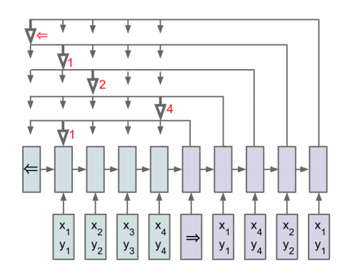

# Pointer Networks
TensorFlow implementation of a Pointer Network (https://arxiv.org/abs/1506.03134)

## Introduction
Pointer networks are a neural network architecture that deal with
problems whose output dimensions depend on the length of the input.
They have found success in QA systems, where the answer to a question
can be identified by two pointers (start & end) in a passage of text.
   
We have created a synthetic dataset for which a pointer net is suitable:
a sequence of random sentences involving two subjects "he" and "she", where
the label is the final location of "she".  

```
he went home happily ten minutes ago. she went home slowly yesterday.
                                               ^^^^
she went to germany yesterday. she went home quickly.
                                        ^^^^
she happily went to japan earlier. he suddenly went to the kitchen yesterday.
                    ^^^^^                                     
``` 

## Installation & Training
We use [GloVe](https://nlp.stanford.edu/projects/glove/) to generate
vector representations of words. To install pre-trained vectors, run
```
./setup.sh
```
The following is optional (to be run if you want to generate custom data, 
re-train the model etc.)
```
python data.py     # generate dataset
python glove.py    # generate embedding matrix of only words in vocab
python train.py    # train model
```

## TensorFlow Model

Pointer networks are a simplification of seq2seq models with attention.
An encoder network reads the input data, producing an embedding vector
for each input. A decoder network then begins generating outputs - with 
a pointer network, the softmaxed attention weights over the inputs are used
as probabilistic "pointers" that point to an element in the input sequence.  
 


The inputs to the pointer network are integer-encoded passages. To account
for the fact that each input passage may be of variable length, we also
input the actual, non-padded length of each sequence. This allows for dynamic
unrolling of the encoder network.
```python 
self.encoder_inputs = tf.placeholder(tf.int32, [batch_size, seq_length])
self.input_lengths = tf.placeholder(tf.int32, [batch_size])
```

At training time, we supply the labelled pointers (in our case, the index of
the word that is the answer). The inputs to the decoder network are a special
start token, followed by the sequence of inputs that the true pointers point to.
This is achieved using a combination of `tf.stack`/`tf.unstack` and `tf.gather`.
The expected outputs of the decoder network are its inputs, shifted over one 
time step.
```python
self.pointer_labels = tf.placeholder(tf.int32, [batch_size, n_pointers])
start_tokens = tf.constant(START_TOKEN, shape=[batch_size], dtype=tf.int32)
self.decoder_labels = tf.stack([tf.gather(inp, ptr) for inp, ptr in 
                                list(zip(tf.unstack(self.encoder_inputs), tf.unstack(self.pointer_labels)))])
self.decoder_inputs = tf.concat([tf.expand_dims(start_tokens, 1), self.decoder_labels], 1)
self.output_lengths = tf.constant(n_pointers, shape=[batch_size])
```

We use the `tf.nn.embedding_lookup` method to look up the vector representation of
each word in the input sequences of both the encoder and decoder. We set `trainable=True`
in the embedding lookup table so that the model learns to distinguish between the start
and end tokens (which are both initially encoded as zero vectors).
```python
word_matrix = tf.constant(np.load('./data/word_matrix.npy'), dtype=tf.float32)
self.word_matrix = tf.Variable(word_matrix, trainable=True, name='word_matrix')
self.input_embeds = tf.nn.embedding_lookup(self.word_matrix, self.encoder_inputs)
self.output_embeds = tf.nn.embedding_lookup(self.word_matrix, self.decoder_inputs)
```

The encoder network is a standard RNN - if the number of layers is greater than 1, we
use the `MultiRNNCell` class to create a single callable cell, which we pass to `tf.nn.dynamic_rnn`.
```python
if n_layers > 1:
    enc_cell = tf.contrib.rnn.MultiRNNCell([cell(n_units) for _ in range(n_layers)])
else:
    enc_cell = cell(n_units)
self.encoder_outputs, _ = tf.nn.dynamic_rnn(enc_cell, self.input_embeds, self.input_lengths, dtype=tf.float32)
```

Here, we use the `BahdanauAttention` class to compute attention weights and context vectors as this was used in
the original paper - this can be substituted with other mechanisms such as Luong attention if desired.
```python
attention = tf.contrib.seq2seq.BahdanauAttention(n_units, self.encoder_outputs,        memory_sequence_length=self.input_lengths)
```

The `GreedyEmbeddingHelper` ensures that at training time, the decoder network uses the predicted pointer (i.e. the
argmax over the attention weights) as the true label, feeding in the element of the input sequence indexed by the
pointer as the next input to the decoder network. The decision to use this over the `TrainingHelper` is a 
hyperparameter - using the `TrainingHelper` allows the model to maximize the conditional probability over the correct
output at each time step, whereas the `GreedyEmbeddingHelper` makes the model auto-regressive and more closely resembles
the behavior of the model at test time.  
Once the decoder cell has been created, we wrap it using the `AttentionWrapper` so that it concatenates the input vector
and context vector at every time step. Here, it is important to set `alignment_history=True` so that we record the
attention weights at each time step - these are the pointers! We use the `OutputProjectionWrapper` to project the 
output of the decoder into a vector space with correct dimensions (i.e. vocab size) and use the `BasicDecoder` and 
`dynamic_decode` to run the decoder network.
```python
helper = tf.contrib.seq2seq.GreedyEmbeddingHelper(self.word_matrix, start_tokens, END_TOKEN)
if n_layers > 1:
    dec_cell = tf.contrib.rnn.MultiRNNCell([cell(n_units) for _ in range(n_layers)])
else:
    dec_cell = cell(n_units)
attn_cell = tf.contrib.seq2seq.AttentionWrapper(dec_cell, attention, alignment_history=True)
out_cell = tf.contrib.rnn.OutputProjectionWrapper(attn_cell, word_matrix.shape[0] - 2)
decoder = tf.contrib.seq2seq.BasicDecoder(out_cell, helper, out_cell.zero_state(batch_size, tf.float32))
self.decoder_outputs, dec_state, _ = tf.contrib.seq2seq.dynamic_decode(decoder, maximum_iterations=n_pointers)
```

The pointers can be extracted from the graph by stacking the alignment history from the final hidden state of the decoder.
The alignment history is a TensorArray that we stack to produce a time major array - the discrete pointers are then
the argmax over `axis=2`.
```python
self.pointer_prob = tf.reshape(dec_state.alignment_history.stack(), [n_pointers, batch_size, seq_length])
self.pointers = tf.unstack(tf.argmax(self.pointer_prob, axis=2, output_type=tf.int32))
```

As opposed to a traditional seq2seq model, we do not calculate loss over the outputs, but over the values of the pointeres.
Each pointer is a classification of n inputs, where n is the length of the input sequence, so we use cross entropy loss.
The following averages the loss over the value of each pointer, and computes the fraction of samples for which every pointer
matched its label in `exact_match`.
```python
loss = tf.zeros(())
pointers = tf.unstack(self.pointer_prob)
labels = tf.unstack(self.pointer_labels, axis=1)

equal = []
for i in range(n_pointers):
    loss += tf.nn.sparse_softmax_cross_entropy_with_logits(labels=labels[i], logits=pointers[i])
    equal.append(tf.equal(self.pointers[i], labels[i]))
self.loss = tf.reduce_mean(loss)
self.correct = tf.cast(tf.stack(equal), tf.float32)
self.all_correct = tf.cast(tf.equal(tf.reduce_sum(self.correct, axis=0), n_pointers), tf.float32)
self.exact_match = tf.reduce_mean(self.all_correct)
```

We use Adam as our default optimizer.
```python
with tf.variable_scope('training'):
   self.train_step = tf.train.AdamOptimizer(learning_rate).minimize(self.loss)
```

## Performance

Our model achieves 100% test accuracy on this synthetic task.
